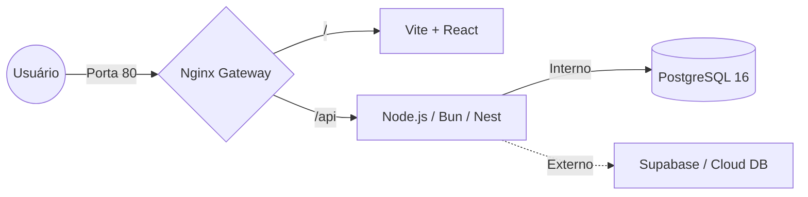

# Fullstack Docker Gateway: Dev to Production Setup

Este repositório fornece um esqueleto (boilerplate) de infraestrutura moderna para o desenvolvimento de aplicações Fullstack. A ideia central é simular um ambiente de produção real desde o primeiro dia de desenvolvimento, eliminando problemas comuns como CORS e falhas de conectividade entre containers.

## 💡 A Ideia Central

A arquitetura é baseada em um **Proxy Reverso (Nginx)** que atua como um Gateway Unificado. Ao invés de acessar o frontend em uma porta (5173) e o backend em outra (3333), você acessa tudo através de um único ponto de entrada na porta `80`.

### Vantagens desta abordagem:
1.  **Zero CORS:** Como as requisições para o backend são feitas através de `/api`, o navegador entende que o frontend e o backend estão na mesma origem.
2.  **Ambiente de Produção Fiel:** Simula exatamente como a aplicação será servida em um servidor real ou cluster Kubernetes.
3.  **Hot Reload (HMR) Funcional:** Configuração otimizada para que o WebSocket do Vite funcione perfeitamente através do proxy.
4.  **Backend "Quadro em Branco":** Infraestrutura pronta para receber qualquer tecnologia (Nest.js, Bun, Fastify, Go) com mínima configuração.

## 🏗️ Arquitetura do Sistema



## 🛠️ Tecnologias Utilizadas

-   **Gateway/Proxy:** Nginx (Alpine)
-   **Frontend:** React + Vite + TypeScript
-   **Backend:** Node.js 20 (Agnóstico a ORM)
-   **Banco de Dados:** PostgreSQL 16
-   **Orquestração:** Docker Compose
-   **Automação:** Makefile

## 🚀 Como Iniciar

Certifique-se de ter o **Docker** e o **Make** instalados em sua máquina.

1.  Clone o repositório.
2.  No terminal, execute:
    ```bash
    make build
    ```
3.  Acesse a aplicação em: [http://localhost](http://localhost)

## 📁 Estrutura de Pastas

-   `/frontend`: Código fonte do frontend e configurações específicas do Nginx.
-   `/backend`: API e lógica de conexão com banco de dados.
-   `/docker-compose.yml`: Orquestração de todos os serviços.
-   `Makefile`: Atalhos para comandos Docker e tarefas comuns.

## 🔌 Configuração de Banco de Dados

O setup vem preparado para alternar entre um banco de dados local e um externo (como Supabase) via variável de ambiente:

-   `USE_EXTERNAL_DB=false`: Utiliza o container `db` (Postgres 16).
-   `USE_EXTERNAL_DB=true`: Utiliza a URL fornecida em `DATABASE_URL_EXTERNAL`.

---

Desenvolvido para ser simples, rápido e escalável. Sinta-se à vontade para substituir as peças desta arquitetura conforme a necessidade do seu projeto.
